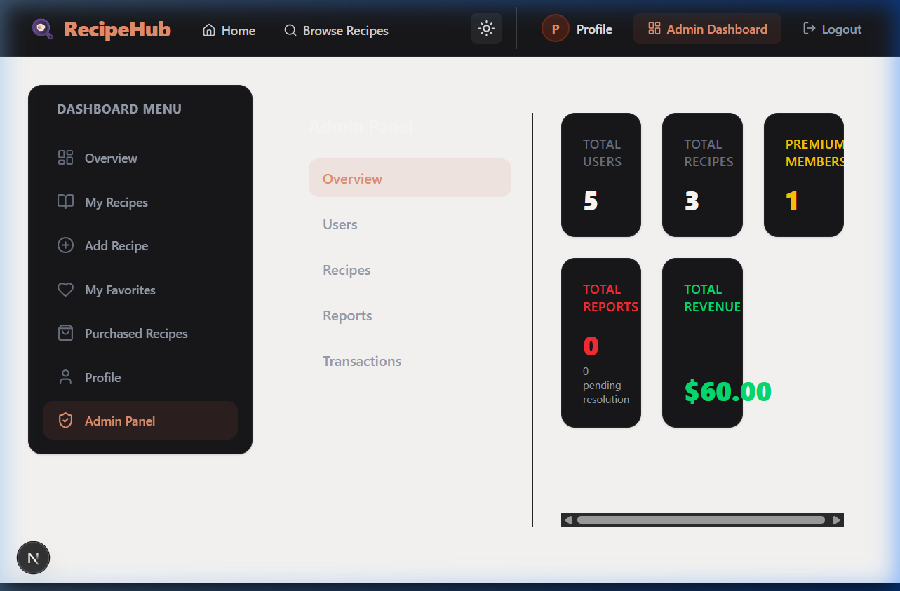

<div align="center">
  <h1>🍳 RecipeHub</h1>
  <p><strong>A Modern, Feature-Rich Recipe Sharing Platform</strong></p>
  
  [](https://nextjs.org/)
  [](https://react.dev/)
  [](https://tailwindcss.com/)
  [](https://stripe.com/)
  [](https://better-auth.com/)
</div>

<br />

<div align="center">
  
</div>

<br />

## 🌐 Live Site Link
*(Add your deployment link here)*

## 📖 Project Overview
RecipeHub is a comprehensive and interactive full-stack web application designed for food enthusiasts to discover, share, and manage recipes. The platform provides a seamless user experience with robust authentication, role-based access control, premium membership features via Stripe, and an intuitive admin dashboard for complete platform management. 

It is built with a modern tech stack focusing on performance, responsive design, and an excellent user interface utilizing Next.js 15, React 19, and Tailwind CSS.

---

## ✨ Features

### User Features
- **Recipe Discovery**: Browse and search through a rich collection of recipes.
- **Recipe Management**: Create, edit, and delete personal recipes.
- **Favorites System**: Save and remove recipes from a personalized favorites list.
- **Reporting**: Report inappropriate recipes or users to the admin team.
- **Dark/Light Mode**: Full theme switching support for better accessibility.
- **Profile Dashboard**: Manage personal information and view added/favorite recipes.
- **Interactive UI**: Micro-animations and responsive design using Framer Motion.
- **Toast Notifications**: Real-time feedback for all actions (React Hot Toast).

### Admin Features
- **Dynamic Dashboard**: View real-time statistics (Total Users, Recipes, Premium Members, Reports, Revenue).
- **User Management**: View all users, and block/unblock accounts to restrict access.
- **Recipe Management**: View, edit, feature, and delete any recipe on the platform.
- **Transactions**: Monitor premium membership payments and revenue.
- **Reports Management**: Review and resolve user-submitted reports.
- **Role-Based Redirection**: Dedicated secure routing and layout for administrators.

### 🛡️ Authentication
- **Better Auth Integration**: Secure, modern authentication handling.
- **Google Login**: One-click OAuth login via Google.
- **Email/Password**: Standard secure registration and login.
- **Protected Routes**: Next.js Middleware strictly protects `/dashboard` and `/admin` routes.
- **Session Handling**: Persistent secure sessions across the application.

### 💎 Premium Features
- **Stripe Checkout**: Seamless payment integration for premium upgrades.
- **Unlimited Recipes**: Premium members can bypass the standard recipe creation limits.
- **Exclusive Badge**: Visual recognition across the platform for premium users.
- **Instant Activation**: Immediate premium status update upon successful payment.

---

## 💻 Tech Stack
- **Framework**: Next.js 15 (App Router)
- **Library**: React 19
- **Styling**: Tailwind CSS, Next Themes
- **Authentication**: Better Auth
- **State Management / Forms**: React Hook Form, Zod (Validation)
- **Animations**: Framer Motion
- **Payments**: Stripe
- **Notifications**: React Hot Toast
- **Icons**: Lucide React

### Major NPM Packages
- `@better-auth/mongo-adapter`
- `@stripe/stripe-js`
- `axios`
- `framer-motion`
- `react-hook-form`
- `react-hot-toast`
- `zod`

---

## 📂 Folder Structure Overview
```text
recipe-hub/
├── src/
│   ├── app/                 # Next.js App Router pages and API routes
│   │   ├── (auth)/          # Login, Register pages
│   │   ├── dashboard/       # User & Admin dashboards
│   │   ├── recipe/          # Recipe details and dynamic routes
│   │   └── api/             # Next.js backend/auth routes
│   ├── components/          # Reusable UI components
│   │   ├── shared/          # Navbar, Footer, Loader
│   │   └── dashboard/       # Dashboard specific components
│   ├── lib/                 # Utility functions, Auth config, DB setup
│   └── middleware.js        # Route protection and role verification
├── public/                  # Static assets
├── tailwind.config.js       # Tailwind configuration
└── package.json             # Dependencies and scripts
```

---

## 🔐 Environment Setup

Environment variables are required for:
- Authentication
- MongoDB
- Google OAuth
- Image Upload Service
- Stripe Payments

Please configure the required environment variables locally before running the project.

---

## 🚀 Installation Guide

1. **Clone the repository**
   ```bash
   git clone https://github.com/your-username/Recipe_Hub.git
   cd Recipe_Hub/recipe-hub
   ```

2. **Install dependencies**
   ```bash
   npm install
   ```

3. **Run the Development Server**
   ```bash
   npm run dev
   ```
   The application will start on `http://localhost:3000`.

---

## 📱 Responsive Design
The platform is fully responsive and optimized for:
- Desktop & Laptops
- Tablets (iPad, etc.)
- Mobile Devices (Seamless navigation, touch-friendly interfaces, and adaptive grid layouts)

---

## 🚀 Future Improvements
- AI-based Recipe Recommendations.
- Social features: Comments, User Follows, and Activity Feeds.
- Weekly Meal Planner integration.
- Export recipes to PDF.

<br />
<div align="center">
  <p>Built with ❤️ for Recipe Hub</p>
</div>
